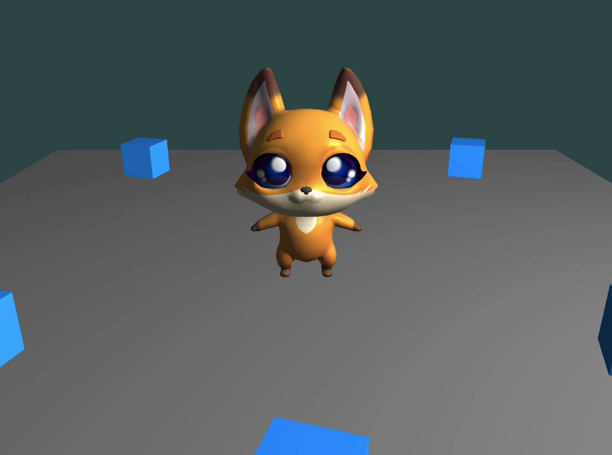

# Assignment 3: Simple 3D Game

## Features

This is a simple 3D game implementation with the following features:

### 1. Model Loading
- **Player Model**: The fox character model (`LP_Firefox.obj`) is loaded from the resource directory
- **Scene**: A ground plane serves as the game scene
- **Items**: Box objects (cubes) are placed around the scene as collectible items

### 2. Player Controls
- **W**: Move forward
- **S**: Move backward
- **A**: Move left
- **D**: Move right
- **Mouse**: Look around (camera follows player)
- **ESC**: Exit game

The player model rotates to face the movement direction.

### 3. Camera System
- The camera follows the player model at a fixed offset
- Camera position: 5 units above and 10 units behind the player
- Mouse look controls allow you to rotate the camera view
- Scroll wheel adjusts zoom level

### 4. Collision Detection
- **Player-Scene Collision**: Player cannot move outside the ground boundaries
- **Player-Item Collision**: When the player collides with an item box, it gets collected and disappears
- AABB (Axis-Aligned Bounding Box) collision detection is used

## Building

1. Make sure you have CMake installed
2. Navigate to the project root directory
3. Run the build script:
   ```bash
   ./build.sh
   ```
   Or manually:
   ```bash
   mkdir -p build
   cd build
   cmake ..
   make
   ```

## Running

After building, run the executable from the build directory:
```bash
cd build/Assignment\ 3
./Assignment_3
```

**Important**: Make sure you run the executable from the `build/Assignment 3/` directory, or the resource files may not be found. The CMake build process should automatically copy resources to the build directory.

If you're running from Xcode or another IDE, you may need to set the working directory to `$(PROJECT_DIR)/build/Assignment 3/` in your run configuration.

## Result Preview

### Screenshot


### Gameplay Clip
<video src="resource/result/Cat-2.mp4" width="640" controls>
  Your browser does not support the video tag. You can download the clip <a href="resource/result/Cat-2.mp4">here</a>.
</video>

## Game Mechanics

- The game starts with the player (fox) at the origin (0, 0, 0)
- There are 6 collectible item boxes scattered around the scene
- Collect all items by moving your character into them
- The console will display how many items remain when you collect one
- The ground plane is 20x20 units in size
- Items are positioned at various locations around the scene

## Technical Details

- **Rendering**: OpenGL 3.3 Core Profile
- **Shaders**: Custom vertex and fragment shaders with Phong lighting
- **Model Format**: OBJ files with texture support
- **Libraries**: GLFW, GLAD, GLM, stb_image

## File Structure

```
Assignment 3/
├── main.cpp              # Main game loop and logic
├── camera.h/cpp          # Camera class implementation
├── model.h/cpp           # Model loader (OBJ file loader)
├── resource/
│   ├── shaders/
│   │   ├── model.vs      # Vertex shader
│   │   └── model.fs      # Fragment shader
│   └── pbr-low-poly-fox-character/
│       ├── source/
│       │   └── LP_Firefox.obj
│       └── textures/
│           └── LP_Firefox_1001_BaseColor.png
└── CMakeLists.txt        # Build configuration
```
